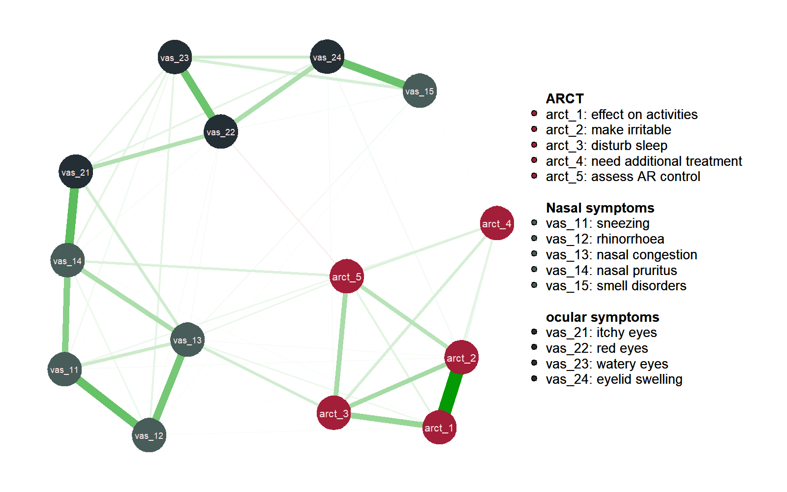
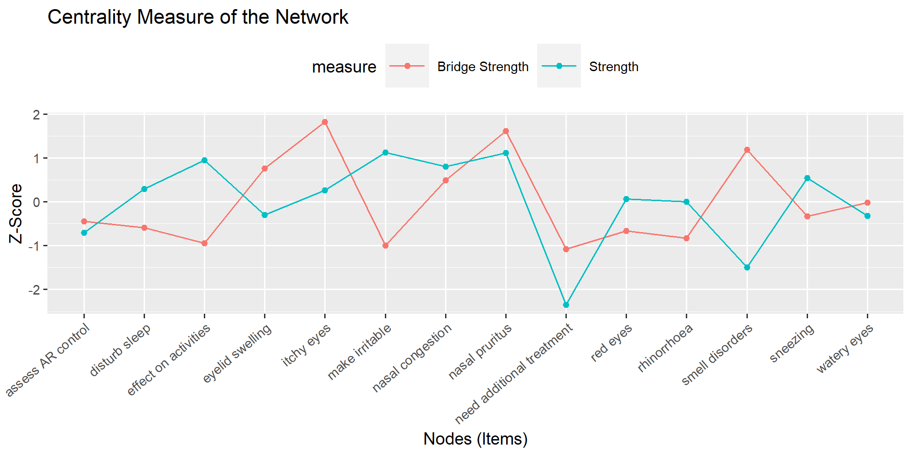

# Relationship between/within symptoms and distresses among China’s children with allergic rhinitis: a network analysis
This is a repo for a questionnaire data analysis project of a survey of allergic diseases, which is led by the [State Key Laboratory of respiratory diseases (Guangzhou Medical University)](http://www.sklrd.cn/), by _Chen Tianhao_,  _Prof. Xiaohua Douglas Zhang_, and _Prof. Sun Baoqing_.

Allergic rhinitis (AR) is one of the most common chronic disorders in the pediatric population and the occurrence of AR during childhood has persistent adverse effects on daily life. Visual Analogue Scales (VAS) and Likert scales (Allergic Rhinitis Control Test, ARCT), based on latent variable models and validated, are widely utilized to assess AR symptom severity and distresses respectively. However, the assumption of local independence of latent variable model makes it difficult to investigate the correlation between the latent variables. The latest developed network analysis approaches could be used to handle the challenge. 

Here we estimate a regularized partial correlation network integrating VAS and ARCT data from 405 China’ s children with AR, and carry out stability analysis to evaluate the model. This visualization of the network model is shown as figure 1.

figure 1 A visualization for regularized partial correlation network of VAS and ARCT data

Based on the model, centrality measures (i.e. Strength and Bridge Strength) of the nodes (i.e. items), are computed, and the results is given as figure 2. 

figure 2 Centrality measures of the nodes

Our results identify “effect on activities”, “make irritable” in distresses dimension and “nasal pruritus”, “itchy eyes” in severity dimension as central nodes. It also reveals that “nasal pruritus”, “itchy eyes” and "smell disorders" are bridge symptoms according to bridge strength.

Stability analysis is also carried out, and the results show that the model is robust.

Our work adds to the existing knowledge base with the first effort analyzing the AR-related scale data via network approach and provides novel insights for AR management. 

